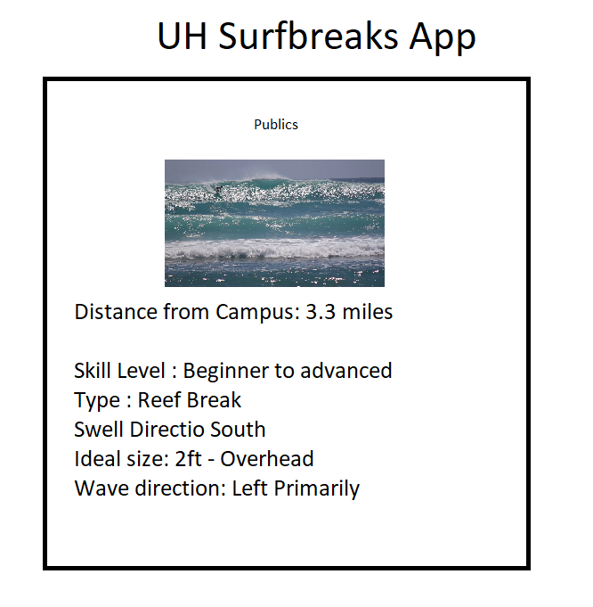

# Surfers' Spot

## Table of contents

* [Overview](#overview)
* [Team](#team)

## Overview

Idea from [Constantine Peros and his group](https://cperos.github.io/essays/final-project-idea.html)

Problem: There are students that come to UH Manoa from all over the world and want to experience Hawaii as a whole, in order to do that they want to try surfing. Students that are coming come from various skill levels and would like to know where the most suitable location for surfing on Oahu would be for them. 

Solution: With the Surfers' Spot app it will help UH students identify the surf breaks that are most suitable for their skill level based on the direction of the swell, season and their location.  

The idea behind this app is to list and categorize various beaches and surf breaks around Oahu. The breaks could be listed based off of their distance from the campus, skill level, wave direction (left or right), ideal swell direction, and ideal swell size. This app could be helpful for the students who have come to UH Manoa from other place and would like to know which beaches would be ideal to surf for their skill level. We could include potential hazards as well as a basic description of the locations. Other information that could be added to the different locations is other activities that can be done. Such as, swimming, fishing, snorkeling, volleyball, etc. We plan on having two roles, an administrative role and a basic user role. Basic users can view the places while administrators would be able to make changes. Different tabs can be used to reflect the different skill levels or other categories. A user can also specify their skill level and get various suggestions based on their skill level. When users log in and set up their profiles they can browse and receive suggestions. We could also implement a rating system where users would be able to rate the different breaks. 

  

## Team

Surfers Spot is designed, implemented, and maintained by Kristi Chinen, Victor Ho, Micheal Lavers, Brennan Lincoln, and Aaron Thomas.

