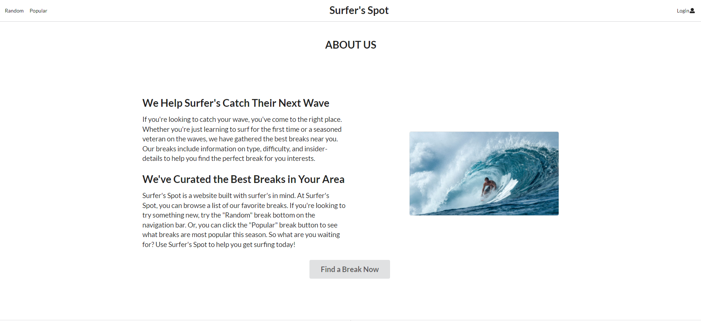

# Surfers' Spot

# Table of contents

* [GitHub](#github)
* [Overview](#overview)
* [User Guide](#user-guide)
* [Deployment](#deployment)
* [Developer Guide](#developer-guide)
* [Development History](#development-history)
* [Team](#team)

# Github
[Github](https://github.com/surfers-spot/surfers-spot)

# Overview

Problem: There are students that come to UH Manoa from all over the world and want to experience Hawaii as a whole, in order to do that they want to try surfing. Students that are coming come from various skill levels and would like to know where the most suitable location for surfing on Oahu would be for them. 

Solution: With the Surfers' Spot app it will help UH students identify the surf breaks that are most suitable for their skill level based on the direction of the swell, season and their location.  

The idea behind this app is to list and categorize various beaches and surf breaks around Oahu. The breaks could be listed based off of their distance from the campus, skill level, wave direction (left or right), ideal swell direction, and ideal swell size. This app could be helpful for the students who have come to UH Manoa from other place and would like to know which beaches would be ideal to surf for their skill level. We could include potential hazards as well as a basic description of the locations. Other information that could be added to the different locations is other activities that can be done. Such as, swimming, fishing, snorkeling, volleyball, etc. We plan on having two roles, an administrative role and a basic user role. Basic users can view the places while administrators would be able to make changes. Different tabs can be used to reflect the different skill levels or other categories. A user can also specify their skill level and get various suggestions based on their skill level. When users log in and set up their profiles they can browse and receive suggestions. We could also implement a rating system where users would be able to rate the different breaks. 

# User Guide
This section will provide a walk through of the Surfers' Spot interface and its capabilities. 

### Landing Page
This is the landing page users will see when they visit the site. 

  

### Sign Up Page
When wanting to create an account on our site you will be presented with this page. 

  

### Adding Your Information
After creating your account you will then be prompted with information to allow for the site to narrow down your searches for the different breaks. 

  

### About Us
In our footer we have a tab that gives users an overview of us and it gives a little overview of our purpose of our site and you are able to read some of our recent reviews and find surf lessons that are happening near you. 

  

  

### Random Break
When accessing our random break link a random break will appear with its level of difficulty, location, and type of break. 

  

# Deployment
[Surfers' Spot](https://surfersspot.xyz/#/)

# Developer Guide
### Installation 
- First, [install Meteor](https://www.meteor.com/developers/install)

- Second, download a copy of [Surfers' Spot](https://github.com/surfers-spot/surfers-spot) and clone it to your laptop 

- Third, cd into the app/directory and install the libraries with 

`$ meteor npm install`

- Forth, run the system with 

`$ meteor npm run start`

- If all goes well it will appear at [http://localhost:3000/](http://localhost:3000/) 

# Development History

### Final Project: Milestone 1
[Milestone 1](https://github.com/surfers-spot/surfers-spot/projects/1)

***

### Final Project: Milestone 2
[Milestone 2](https://github.com/surfers-spot/surfers-spot/projects/2)

***

### Final Project: Milestone 3
[Milestone 3](https://github.com/surfers-spot/surfers-spot/projects/3)

# Team

Surfers Spot is designed, implemented, and maintained by: 
* [Kristi Chinen](https://kristihchinen.github.io/)
* [Victor Ho](https://hovictor2000.github.io/) 
* [Micheal Lavers](https://sync925.github.io/)
* [Brennan Lincoln](https://blincoln15.github.io/) 
* [Aaron Thomas](https://aaron-toomas.github.io/)

